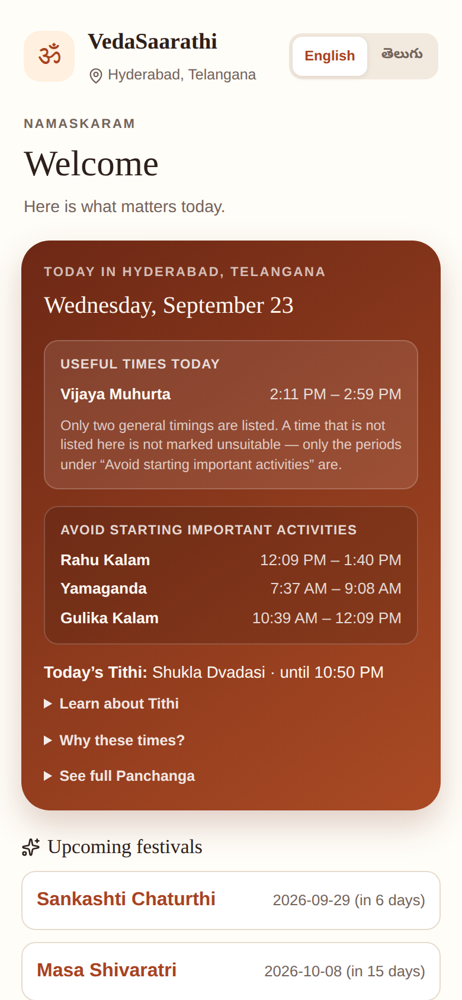
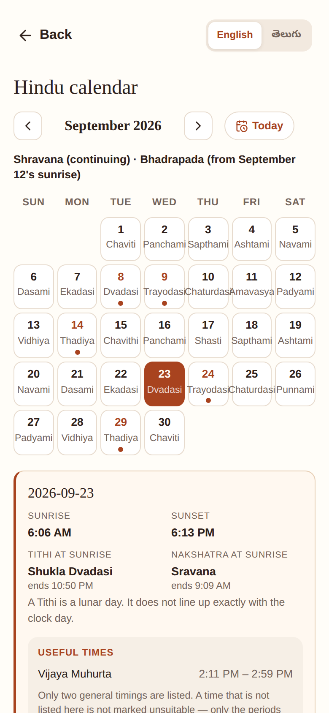
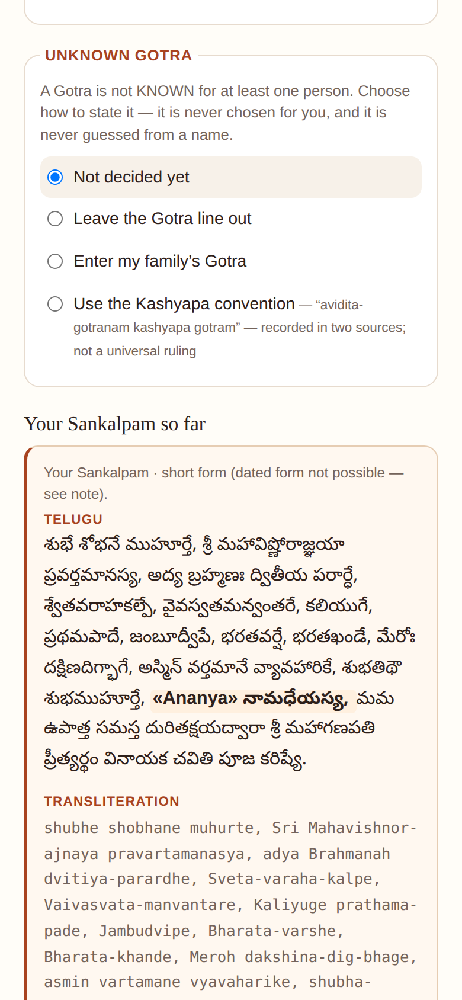
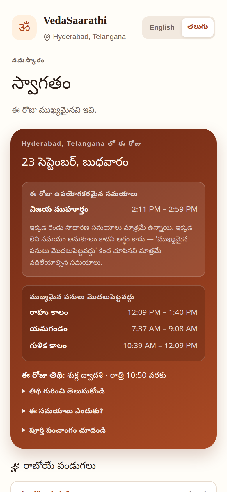

# VedaSaarathi

A free Hindu Panchangam and puja companion for families living anywhere in
the world.

A project by **ASCOR LABS**.

## What you can do

- See today's Panchangam for your saved location.
- Explore the monthly calendar, supported festivals and observances.
- Understand traditional useful and avoid periods.
- Prepare Sankalpam and follow available puja guides.
- Use English or Telugu and download for offline use.

## See the app

<p>
  
  
  
  
</p>

Home · Calendar · Guided puja preparation · Telugu view

Screenshots are from a real build, with a sample location and a fictional
participant name. No private family data is shown.

## Available services

- **Panchangam and Calendar** — the core platform. Today's Panchangam,
  traditional daily timings, and the monthly calendar with festivals and
  observances. Available regardless of which puja guides exist.
- **Sankalpam** — preparation guidance: the short spoken statement of who is
  performing a puja, where, when and why, generated from your saved details.
- **Pujas** — guided puja walkthroughs. Currently available: **Vinayaka
  Chavithi**. More will be added over time; a festival showing on the
  Calendar does not mean a puja guide for it exists yet, and a puja guide
  does not depend on being tied to one specific festival date.

## Get started

1. Choose English or తెలుగు.
2. Save your location (city, region, country — used only to calculate
   sunrise-based timings; never inferred from your device).
3. Explore today's Panchangam and the monthly Calendar.

Try the private preview:
**[vedasaarathi-vinayaka-preview.maheshmutukula.chatgpt.site](https://vedasaarathi-vinayaka-preview.maheshmutukula.chatgpt.site/)**

This is a private testing deployment, not a public release. Nothing you enter
leaves your browser — see [Guidance and current coverage](#guidance-and-current-coverage) below.

## Guidance and current coverage

- Panchangam and timings depend on the location you save; sunrise-based
  values differ by city.
- The festival catalogue is still growing — a month can show "no major
  festival currently listed" without meaning none exists.
- Hindu practice varies by family, region and tradition. VedaSaarathi shows
  general, sourced information and does not present one family's or region's
  practice as universal.
- Some content is awaiting priest review and is labelled as such wherever it
  appears; it is never shown as approved guidance before that review.
- Puja instruction and mantra-pronunciation audio is computer-generated, not
  a human recording.

Full detail, including exactly what's included, what isn't, and how AI and
audio are used: [docs/PRODUCT_DETAILS.md](./docs/PRODUCT_DETAILS.md).

## Feedback and ownership

Found something that doesn't look right, or have a suggestion? Email
**contact.vedasarathi@gmail.com**. This opens your own email app — please
avoid sharing private family details, and include the city and date shown in
the app for a date or timing issue.

We thank Brahmasri Dr. Mamudala Srikanth Sharma, M.A., M.B.A., P.hd —
Jyotisha Shiromani, Jyotisha Praveen, Jyotisha Visharada, Sri Bala Anjaneya
Swamy Temple, Uppal Ring Road — for his initial review and feedback on
selected content in this app. This review is not yet complete, and it does
not mean every calculation, mantra, audio clip or piece of content has been
approved.

© 2026 ASCOR LABS. All rights reserved. Third-party software included with
the app keeps its own licences — see
[THIRD_PARTY_NOTICES.md](./THIRD_PARTY_NOTICES.md).

## For developers

```bash
npm run install:ci   # install dependencies
npm run dev           # start the dev server
npm run build          # production build
npm test               # build + typecheck + unit tests
```

More: [docs/DEVELOPMENT.md](./docs/DEVELOPMENT.md) (setup, full test suite,
build identification and rollback, project structure) ·
[docs/ARCHITECTURE.md](./docs/ARCHITECTURE.md) (design) ·
[docs/PRODUCT_DETAILS.md](./docs/PRODUCT_DETAILS.md) (source, provenance,
privacy) · [IMPLEMENTATION_PLAN.md](./IMPLEMENTATION_PLAN.md) (release
status and backlog) · [docs/README.md](./docs/README.md) (full documentation
index) · [.claude/rules/](./.claude/rules/) and
[CLAUDE.md](./CLAUDE.md) (contribution rules and conventions).
